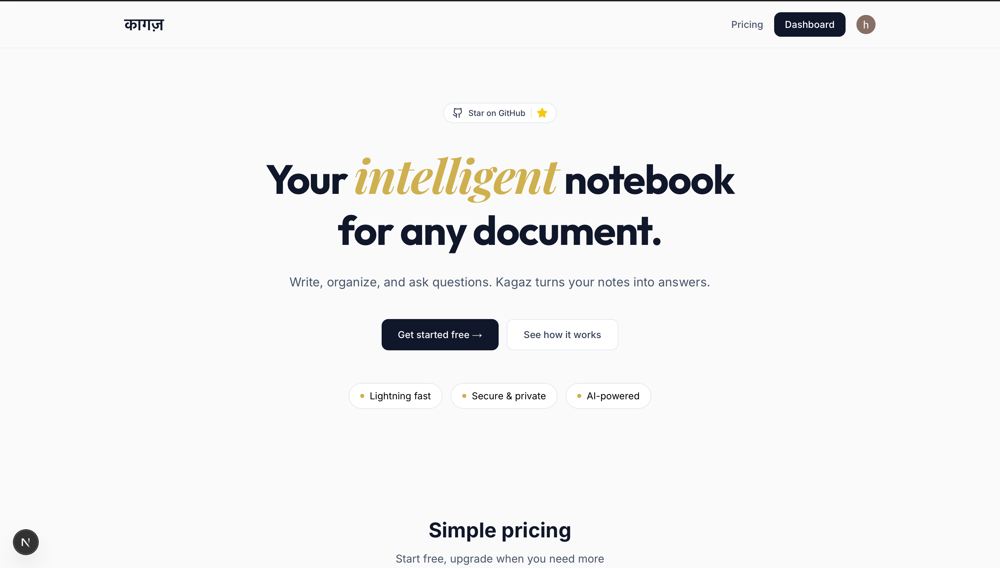
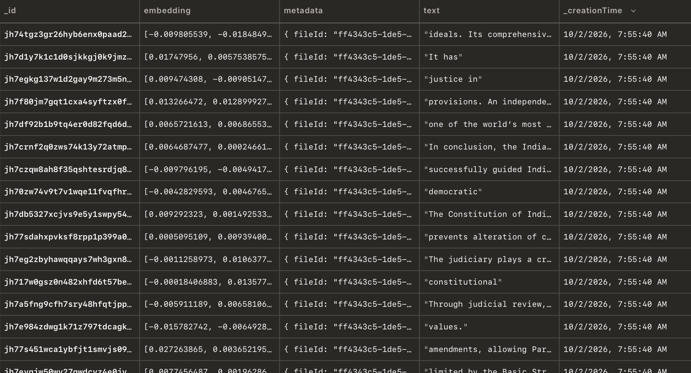

<div align="center">

# 📝 Kagaz

### Your intelligent notebook for any document

*Write, organize, and ask questions. Kagaz turns your notes into answers.*

[](https://github.com/Angshuman09/kagaz)
[](https://nextjs.org/)
[](https://convex.dev/)

[Live Demo](https://kagaz-notes.vercel.app) • [Report Bug](https://github.com/Angshuman09/kagaz/issues) • [Request Feature](https://github.com/Angshuman09/kagaz/issues)

</div>

---

## 📸 Preview



---

## Tech Stack

- **Frontend:** [Next.js 15](https://nextjs.org/) - React framework for production
- **Styling:** [Tailwind CSS](https://tailwindcss.com/) - Utility-first CSS framework
- **Backend:** [Convex](https://convex.dev/) - Real-time backend platform
- **Authentication:** [Clerk](https://clerk.com/) - Complete user management
- **Payments:** [Stripe](https://stripe.com/) - Secure payment processing
- **Deployment:** [Vercel](https://vercel.com/) - Optimal Next.js hosting
- **Language:** TypeScript - Type-safe development

---

### Document Embedding Success



*Screenshot showing successful document processing and embedding generation*

---

## Known Limitations

### Token Limit Constraints

- **Large File Processing**: Due to API token limits, very large PDF files may not be fully processed or embedded
- **Incomplete Embeddings**: Documents exceeding token limits will only have partial content embedded, potentially missing important information
- **Processing Timeouts**: Extremely large documents may experience timeout errors during the embedding process

### Other Limitations

- **File Format Support**: Currently limited to PDF and text files only
- **Context Window**: Answers are based on limited context chunks, which may not capture the full document scope
- **Processing Time**: Large documents require significant time for chunking and embedding generation

---


## 📖 Usage

1. **Sign In**: Create an account or sign in using Clerk authentication
2. **Upload Document**: Click the upload button and select your PDF or text file
3. **Wait for Processing**: The system will extract text, chunk it, and generate embeddings
4. **Ask Questions**: Type your question in the chat interface
5. **Get Answers**: Receive AI-generated answers based on your document content

---

### Prerequisites

- Node.js 18+ and npm
- A Convex account ([sign up here](https://convex.dev/))
- A Clerk account ([sign up here](https://clerk.com/))
- A Stripe account ([sign up here](https://stripe.com/))

---

## Project Structure

```
kagaz/
├── app/                    # Next.js app directory
│   ├── (routes)/          # Application routes
│   ├── layout.tsx         # Root layout
│   └── page.tsx           # Home page
├── components/            # React components
│   ├── ui/               # shadcn/ui components
│   └── ...               # Custom components
├── convex/               # Convex backend
│   ├── notes.ts          # Notes functions
│   ├── fileStorage.ts    # File management
│   ├── user.ts           # User functions
│   └── schema.ts         # Database schema
├── lib/                  # Utility functions
├── public/               # Static assets
└── configs/              # Configuration files
```

---

### Setup Steps

1. **Clone the repository**
   ```bash
   git clone https://github.com/Angshuman09/kagaz.git
   cd kagaz
   ```

2. **Install dependencies**
   ```bash
   npm install
   ```

3. **Configure environment variables**
   
   Create a `.env.local` file in the root directory:
   ```env
    NODE_ENV = development
    CONVEX_DEPLOYMENT= your_convex_deployment
    NEXT_PUBLIC_CONVEX_URL= your_convex_url
    NEXT_PUBLIC_CLERK_PUBLISHABLE_KEY= your_clerk_publishable_key
    CLERK_SECRET_KEY= your_clerk_secret_key
    NEXT_PUBLIC_CLERK_SIGN_UP_URL=/sign-up
    NEXT_PUBLIC_CLERK_SIGN_UP_FALLBACK_REDIRECT_URL=/
    NEXT_PUBLIC_CLERK_SIGN_IN_FALLBACK_REDIRECT_URL=/
    NEXT_PUBLIC_CLERK_SIGN_IN_URL=/sign-in
    NEXT_PUBLIC_CLERK_SIGN_IN_FALLBACK_REDIRECT_URL=/
    NEXT_PUBLIC_CLERK_SIGN_UP_FALLBACK_REDIRECT_URL=/
    CLERK_JWT_ISSUER_DOMAIN= your_jwt_issuer_domain
    GEMINI_API_KEY= your_gemini_api_key
    NEXT_PUBLIC_STRIPE_PUBLIC_KEY = your_stripe_public_key
    STRIPE_SECRET_KEY = your_stripe_secret_key
    STRIPE_WEBHOOK_SECRET = your_stripe_webhook_secret
    STRIPE_PRICE_ID= your_stripe_price_id
    HOST_URL = your_host_url
   ```

4. **Set up Convex**
   ```bash
   npx convex dev
   ```

5. **Run the development server**
   ```bash
   npm run dev
   ```

6. **Open your browser**
   
   Navigate to `http://localhost:3000`

---

## Author

**Angshuman**

- GitHub: [@Angshuman09](https://github.com/Angshuman09)
- Project Link: [https://github.com/Angshuman09/kagaz](https://github.com/Angshuman09/kagaz)

---

## ⭐ Star History

If you find this project useful, please consider giving it a star!

[](https://star-history.com/#Angshuman09/kagaz&Date)

---

<div align="center">

**[⬆ Back to Top](#-kagaz)**

Made with ❤️ by [Angshuman](https://github.com/Angshuman09)

</div>
